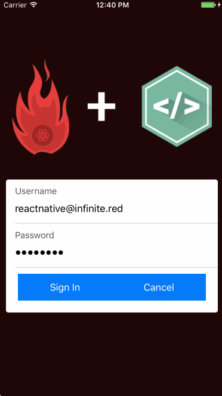
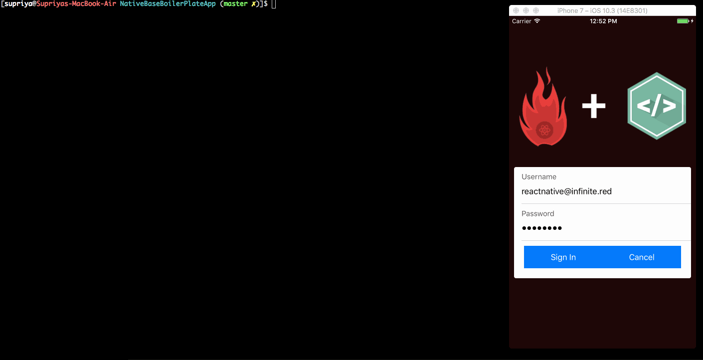

# ignite-native-base-boilerplate v2



## Quick Start

You can run the following command to create the boilerplate, provided you have [Ignite CLI](https://github.com/infinitered/ignite) installed.

```
ignite new appname --boilerplate native-base-boilerplate
```

You can also change the React Native version, just keep in mind, we may not have tested this just yet.

```sh
ignite new appname --react-native-version 0.46.4 --boilerplate native-base-boilerplate
```

By default we'll ask you some questions during install as to which features you'd like.  If you just want them all, you can skip the questions:

```sh
ignite new appname --max --boilerplate native-base-boilerplate
```

If you want very few of these extras:

```sh
ignite new appname --min --boilerplate native-base-boilerplate
```

### Quick Examples

```
$ ignite add maps
$ ignite add vector-icons
$ ignite generate screen ScreenName
$ ignite generate container ContainerName
$ ignite generate component ComponentName
$ ignite generate list ListName
$ ignite generate map StoreLocator
$ ignite add i18n
$ ignite remove i18n
```


### Demo Examples


```
$ ignite generate screen MyNewScreen
```


```
$ ignite generate container MyNewContainer
```


```
$ ignite generate component MyNewComponent
```
This generates a generic components which is reusable in any screen of the app.


```
$ ignite generate list MyNewList
```



